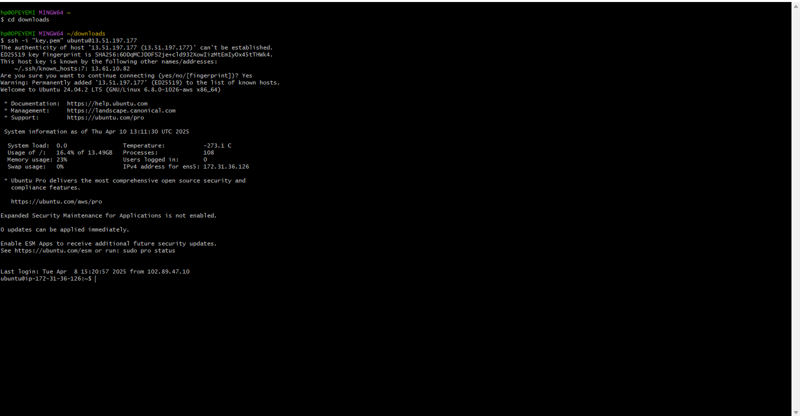
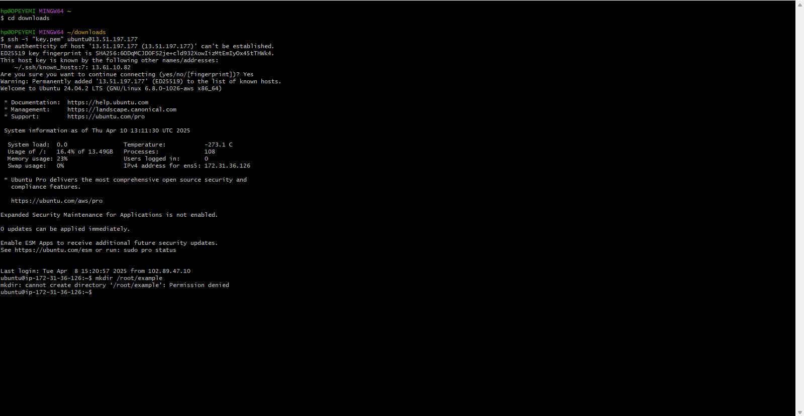
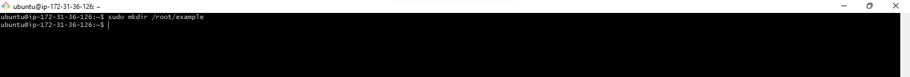
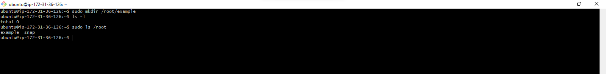
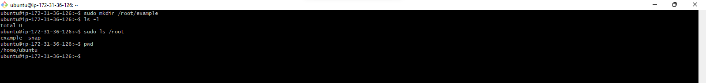
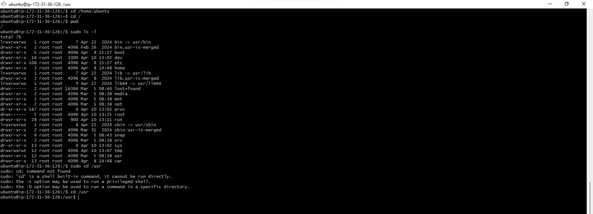
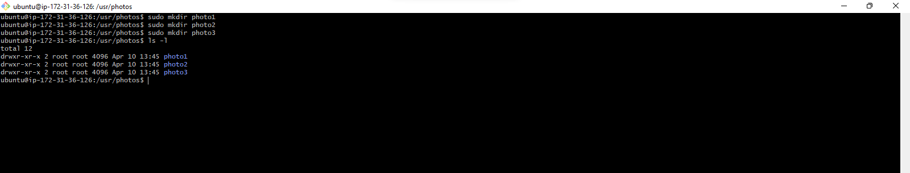
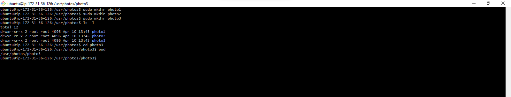
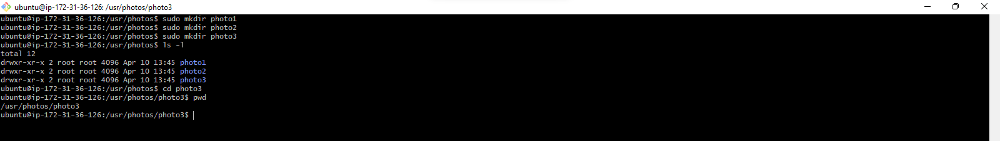
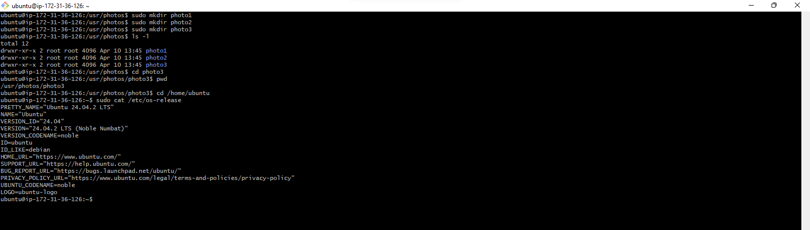

# Basic-Linux-Command Project

Now that learners are familiar with Linux, the purpose of this project is to help learners understand how to use various basic linux commands. Some of these commands include ``cd``, ``ls``, ``pwd``, ``cp``, ``mv`` and the ``sudo`` command. 

## What is a Linux Command?

A linux command is a program that runs in the Command-Line Interface. These commands allow us perform tasks on a linux-based operating system, some of the tasks include installing packages, managing users, manipulating files and directories, configuring system settings etc.

The general syntax of a linux command is as follows: 

``CommandName [Option(s)] [Parameters]``

A command may contain _Options_ and _Parameters_ but they are not always required. The components of a command are described below:

*__CommandName__*: The represent the action or task you want to carry out. Example is the **ls** command which is used to list files in a directory.

**_Option or Flag_**: An option modifies the behaviour of a command. It is typically preceded by a hypen (-) or double hypen (--). Example is when the **_-l_** is added to the ``ls -l`` command, the **_l_** flag allows the **_ls_** to return a more detailed properties of a file in a directory.

**_Parameter or Argument_**: A parameter provides specific data or information for a command to execute a desired action. For example, to create a folder named **photos**, run the command ``mkdir photos``, _mkdir_ is the command while _photos_ is the parameter.

> **Always remember that Linux is case sensitive i.e CD is not the same as cd**

## Working with different Linux Command

Most of your time in linux will be you working with and manipulating files and directories. Some of the linux commands are played with in this project.

### Creating a folder in Linux with Sudo

* Open your terminal and connect to the linux server using ssh using the ``ssh -i "ubuntu.pem" ubuntu@public_ip_address``

* Try to create an _example_ folder in a restricted location using the ``mkdir examples`` command, you will get an error because you do not have the necessary permissions to do so.

* Use the ``sudo mkdir /root/example`` command to create the folder. The sudo command gives administrative right to the user.

* Verify that the _example_ folder has been created using the ``sudo ls/root`` command. The `ls` command lists file in the directory while `/root` specificies the user.

### Print your current working directory.

* The ``pwd`` command is mostly used to find the current working directory. Simply typing ``pwd`` in the terminal will print the full current directory starting with "/"

* Use ``sudo cd /`` to navigate to the root file system.

* Confirm that you're on the root file system by typing ``pwd``. This will return the current directory.

* To list files and directory in the root filesystem, run the ``sudo ls -l`` command.

## Side Hustle Task

* Create a directory called `photos` inside the `/usr` directly by running ``mkdir photos`` command. This command creates a _photos_ command in the _/usr_ directory.

* Navigate into the _photos_ folder.

* Create 3 more random directories inside the _photos_ directory already created. Use the ``mkdir photos1``, ``mkdir photos2``, and ``mkdir photos3`` commands.

* Show the nearly created subfolders in the terminal by running the ``ls -l`` command inside the _photos_ folder.

* Navigate into one of the subfolders by running the ``cd photos3`` command

* Show the current working directory, print on the terminal by running the ``pwd`` command.

## Concatenatinating files

The `concatenate` or `cat` command is one of the frequently used linux command. This command lists, combines, and write files to the standard output(terminal)

* Run the ``sudo cat /etc/os-release`` on the terminal. This command prints the details of the _os-release_ file in the _/etc/_ folder

